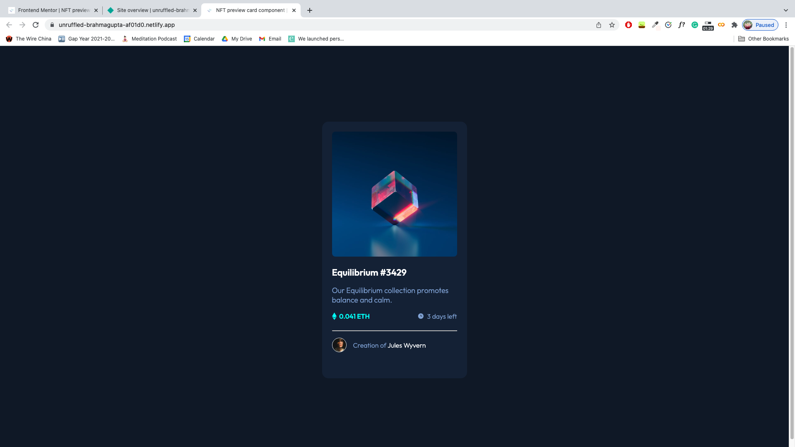
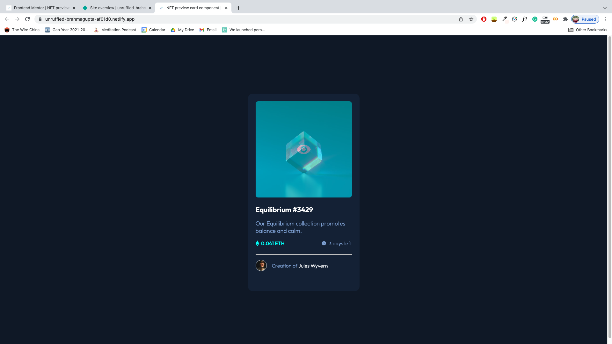
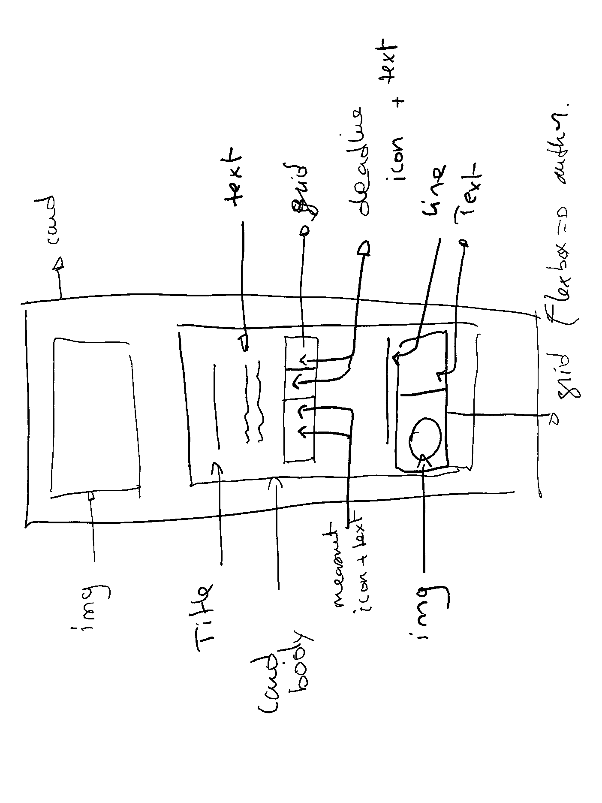

# Frontend Mentor - NFT preview card component solution

This is my solution to the [NFT preview card component challenge on Frontend Mentor](https://www.frontendmentor.io/challenges/nft-preview-card-component-SbdUL_w0U).

## Table of contents

- [Overview](#overview)
  - [The challenge](#the-challenge)
  - [Screenshot](#screenshot)
  - [Links](#links)
- [My process](#my-process)
  - [Built with](#built-with)
  - [What I learned](#what-i-learned)
  - [Continued development](#continued-development)
  - [Useful resources](#useful-resources)
- [Author](#author)
- [Acknowledgments](#acknowledgments)

## Overview

### The challenge

Users should be able to:

- View the optimal layout depending on their device's screen size
- See hover states for interactive elements

### Screenshot

- Desktop View
  

- Desktop View - Active 1 (active image)
  

- Desktop View - Active 2 (active title)
  

- Desktop View - Active 3 (active name)
  

### Links

- Solution URL: [github](https://github.com/Mabchir/nft_preview_card_component)
- Live Site URL: [netlify](https://unruffled-brahmagupta-af01d0.netlify.app/)

## My process

### Built with

- HTML
- CSS custom properties
- Flexbox

### Steps

- Set up the repository, live site and starter files
- created a sketch of the different components I will be needing 
- translated sketch into HTML
- added the class in CSS
- added relevant styling
- optimized redundant code (e.g. display: flex)
- adding hovering styles

### What I learned

- Applied lessons learned in the previous challenge (mainly how to center components to the screen no matter what device in use)
- how to plan the different components prior to starting coding
- how to overlay two components and use it as a hovering styling option
- how to align elements in a flex box using the following code:

```css
.container {
  display: flex;
  align-items: center;
}
```

- how to make edits to a div/component while hovering over a different div/component (note that b should come after a)

```css
#a:hover + #b {
  background: #ccc;
}
```

```html
<div id="a">Div A</div>
<div id="b">Div B</div>
```

### Continued development

- The active version 1 (hovering over the image) has a weird shaky affect, which I am not sure where it's coming from. Maybe exploring the impact of the CSS visibility attribute would be helpful(fixed).

- Learning more ways of overlaying different components.

### Useful resources

- [W3Schools | How TO - Image Hover Overlay](https://www.w3schools.com/howto/howto_css_image_overlay.asp) - This helped me learn more about overlaying two components
- [stackoverflow](https://stackoverflow.com/questions/2941189/how-to-overlay-one-div-over-another-div) - This further help me understand the concept of overlaying two components
- [stackoverflow](https://stackoverflow.com/questions/6910049/on-a-css-hover-event-can-i-change-another-divs-styling) - hover over an element changes the styling of a different element

## Author

- Website - [Mariem Bchir](https://goofy-easley-2c8717.netlify.app/index.html)

- Frontend Mentor - [@Mabchir](https://www.frontendmentor.io/profile/Mabchir)

- Github - [Mabchir](https://github.com/Mabchir)

## Acknowledgments

Shoutout to the following members of Frontend Mentors whose feedback on my first challenge was very helpful in making this challenge a success :

- Frontend Mentor - [@Phalcin](https://www.frontendmentor.io/profile/Phalcin)
- Frontend Mentor - [@denielden](https://www.frontendmentor.io/profile/denielden)
- Frontend Mentor - [@nakoyawilson](https://www.frontendmentor.io/profile/nakoyawilson)
- Frontend Mentor - [@AleksHNZ](https://www.frontendmentor.io/profile/AleksHNZ)
- Frontend Mentor - [@grace-snow](https://www.frontendmentor.io/profile/grace-snow)
